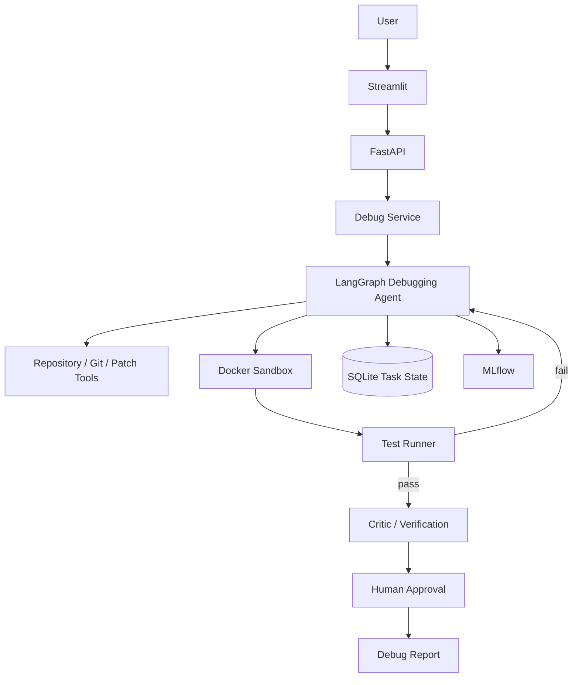
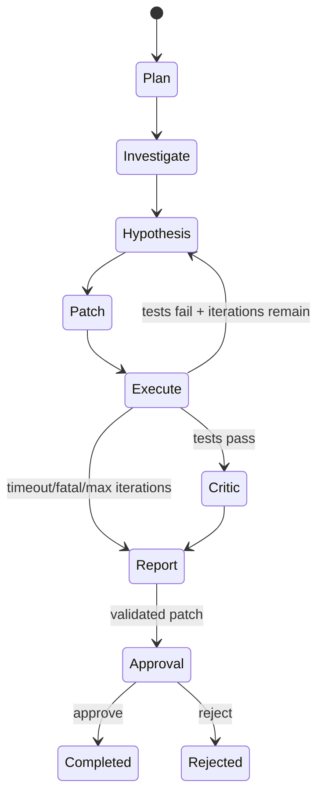
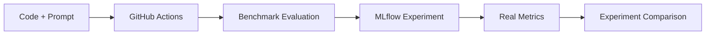

# AI Software Debugger

A portfolio-grade Agentic AI system that investigates and fixes Python repository bugs through tool-driven reasoning, isolated execution, iterative test-based recovery, human approval, and MLflow-backed evaluation.

## Project Overview

The system accepts a Python repository plus a bug report and runs a stateful debugging workflow:

`Bug report → plan → repository investigation → hypothesis → patch → sandbox tests → replan on failure → critic → human approval → report`

The primary agent is a single LangGraph workflow. It uses repository tools rather than relying on a single LLM response.

## Architecture



## Agent Workflow



## MLOps / LLMOps



## Technology Stack

- Python 3.11–3.13
- LangGraph + LangChain Core
- OpenAI-compatible LLM integration
- FastAPI
- Streamlit
- Docker sandbox
- SQLite + SQLAlchemy
- MLflow
- Pytest
- Ruff + mypy
- GitHub Actions

## Why These Choices

- **LangGraph:** explicit state transitions, retries, and human-gated workflow.
- **Single agent:** avoids unnecessary multi-agent coordination while still demonstrating genuine tool use and recovery.
- **Docker:** repository code is untrusted and must not run directly on the host in production mode.
- **SQLite:** sufficient persistence for a one-month portfolio project; avoids operational overhead.
- **MLflow:** experiment and evaluation tracking without pretending that this is a traditional trained-ML model.
- **Repository search instead of a vector DB:** exact code search is deterministic and more useful for this MVP.

See `docs/ARCHITECTURE.md` and `docs/DECISIONS.md` for details.

## Installation

```bash
python -m venv .venv
# Windows: .venv\\Scripts\\activate
# Linux/macOS: source .venv/bin/activate
pip install -e ".[dev]"
copy .env.example .env  # Windows
# cp .env.example .env # Linux/macOS
```

Set `OPENAI_API_KEY` in `.env` for real LLM debugging. Without it, the system can run plumbing/unit tests and safely refuses to invent patches.

## Run the API

```bash
uvicorn src.api.main:app --reload
```

## Run the UI

```bash
streamlit run frontend/app.py
```

## Run Tests

```bash
pytest
ruff check .
mypy src
```

## Run Evaluation

```bash
python -m evaluation.run
```

The command executes the real benchmark through the agent and writes `evaluation_report.json`. It requires an LLM key because patch generation is intentionally not faked.

For MLflow tracking:

```bash
python -m src.evaluation.mlflow_eval
mlflow ui --backend-store-uri ./mlruns
```

## Docker

Build the API and sandbox images:

```bash
docker build -t ai-software-debugger .
docker build -f docker/sandbox.Dockerfile -t ai-software-debugger-sandbox:latest .
```

Run the stack (the compose file mounts the Docker socket so the API can launch the sandbox; use this only on a trusted development host):

```bash
docker compose up --build
```

The sandbox runner additionally starts an ephemeral Python container with no network, dropped Linux capabilities, a PID limit, CPU/memory limits, and a read/write mount restricted to the task workspace.

## Security

The LLM never receives unrestricted shell access. Repository paths are canonicalized and prevented from escaping the workspace. Test commands are allowlisted. Patch application uses `git apply --check`. Sandbox execution disables networking and drops capabilities. Secrets are supplied through environment configuration and are not written to task state.

For production use, harden the container runtime further and consider rootless Docker or a dedicated sandbox service.

## Benchmark

`benchmark/tasks/` contains ten deliberately buggy Python repositories covering edge cases, validation, exception handling, API behavior, data transformation, configuration, authorization, and arithmetic logic.

The evaluation runner calculates metrics from actual executions. It does not ship fabricated performance numbers.

## Example Debugging Session

Use `examples/buggy_orders_app` and enter:

> The `/orders` endpoint returns HTTP 500 when quantity is zero.

With an LLM configured, the agent should inspect the repository, identify the division-by-zero path, propose a minimal patch, execute tests, recover if needed, and stop at human approval.

## CI/CD

GitHub Actions runs linting, unit tests, integration tests, a Docker build, and the benchmark command when credentials are configured. Evaluation is skipped gracefully when an LLM secret is unavailable.

## Limitations

- Python repositories only.
- The Docker sandbox depends on Docker being available to the API process.
- LLM quality affects patch quality.
- Cost/token instrumentation depends on provider response metadata; unsupported providers may report token usage as unavailable.
- The benchmark is small and intended for regression testing, not scientific generalization.
- The UI is intentionally functional rather than production-grade.

## Future Improvements

- Provider-neutral token/cost callbacks.
- Stronger sandboxing with rootless containers and seccomp profiles.
- Repository documentation retrieval when exact search is insufficient.
- Rich tracing with OpenTelemetry.
- Optional MCP adapter exposing the same secure tool layer.

## License

MIT. See `LICENSE`.
